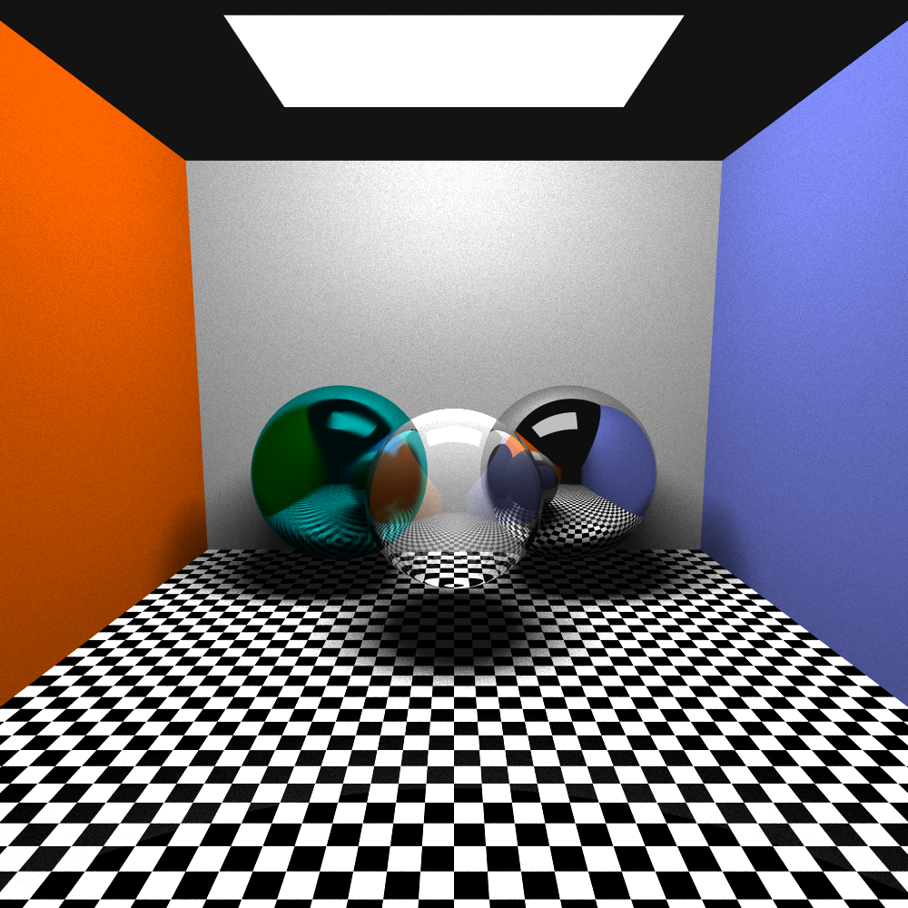

# Ray tracer

Ray tracer built from scratch for CSC 305 class

## Output

  

## Features 

- [x] Mirror reflections
- [x] Glossy Reflections
- [x] Simple Transparency
- [x] Procedural Textures
- [x] Shadows
- [x] Ambient Occlusion
- [x] Area Lights
  

